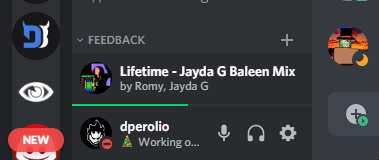
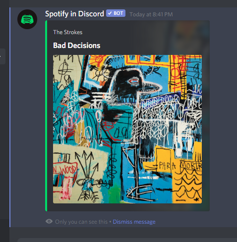
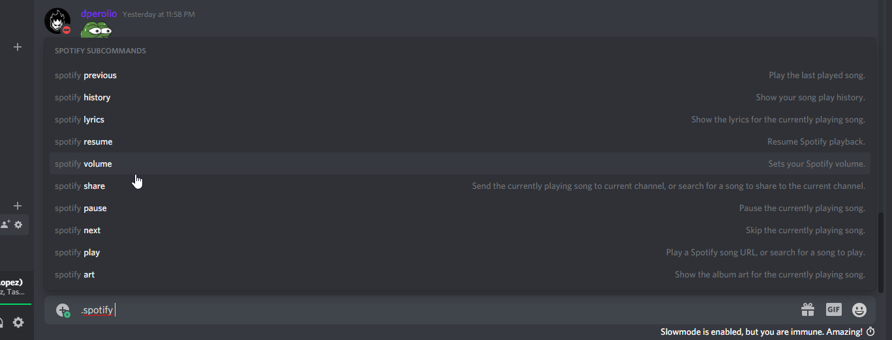
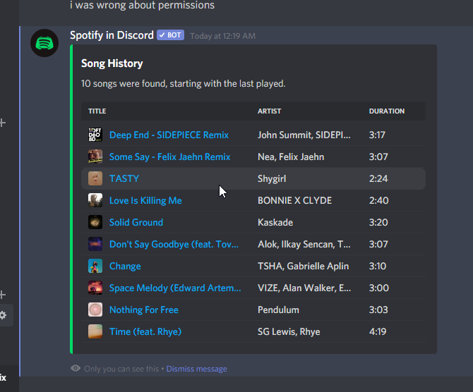
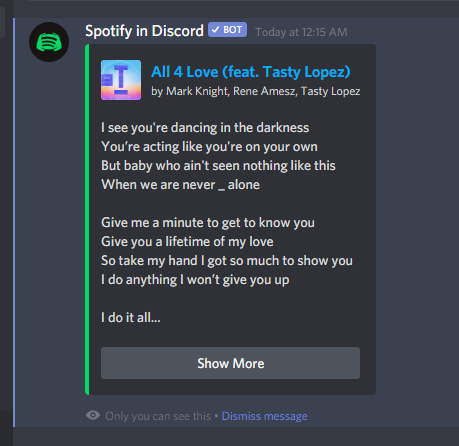
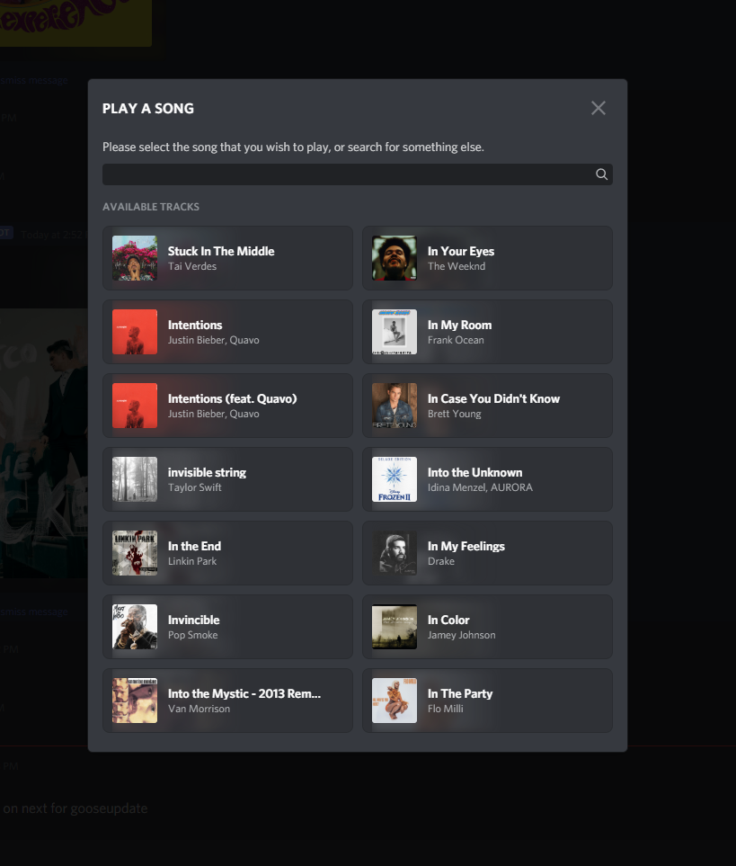
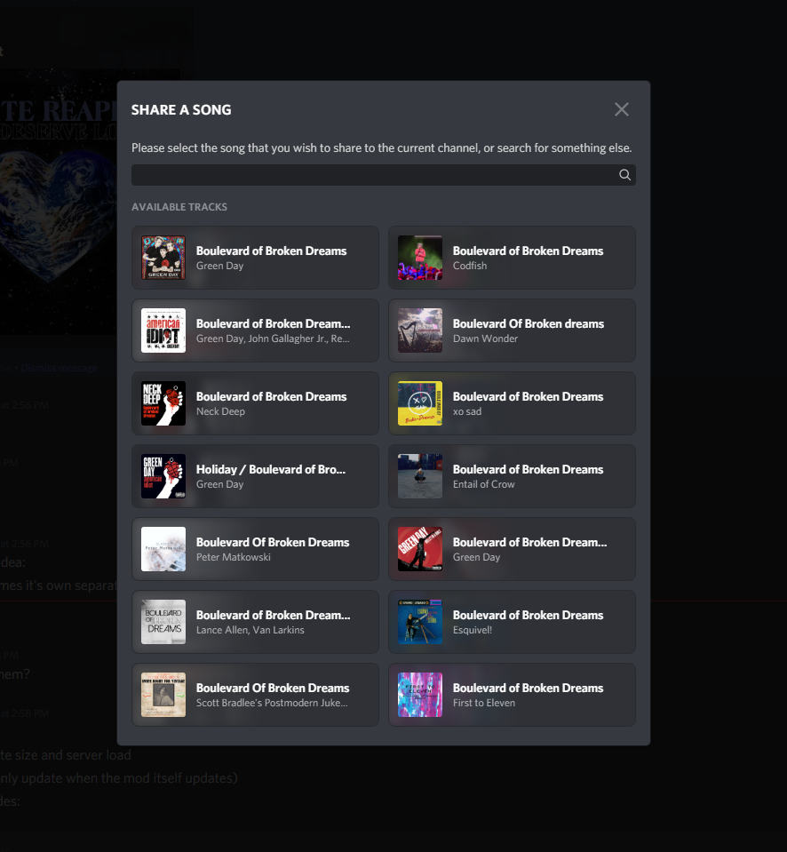

----

# Spotify in Discord

## Description

Control Spotify from within Discord, and includes some other features like getting the currently playing song's lyrics and album cover art.

> Full functionality of this plugin is available to all users, not just Spotify Premium users!

This plugin uses the Spotify Connect Web API to function. One of the great things about the Spotify Connect Web API is that it works cross-platform. This is a fork of the original version created by the Powercord Team for Powercord that I've ported over for use on Vizality with some preferential changes and expansions.

## Features

- Provides a GUI mini-player for controlling Spotify
- Provides some useful commands giving some extra features as well as an alternative way to control your Spotify playback

## Commands

| Command               | Alias  | Arguments                | Description                                                                                               |
| --------------------- | ------ | ------------------------ | --------------------------------------------------------------------------------------------------------- |
| **spotify→ previous** | `prev` | ---                      | Play the last played song.                                                                                |
| **spotify→ history**  | ---    | ---                      | Show your song play history.                                                                              |
| **spotify→ lyrics**   | ---    | ---                      | Show the lyrics for the currently playing song.                                                           |
| **spotify→ resume**   | ---    | ---                      | Resume Spotify playback.                                                                                  |
| **spotify→ volume**   | `vol`  | <0 to 100>               | Sets your Spotify volume.                                                                                 |
| **spotify→ share**    | ---    | \[url \| track\]         | Send the currently playing song to current channel, or search for a song to share to the current channel. |
| **spotify→ pause**    | ---    | ---                      | Pause the currently playing song.                                                                         |
| **spotify→ next**     | `skip` | ---                      | Skip the currently playing song.                                                                          |
| **spotify→ play**     | ---    | \<url \| track\>         | Play a Spotify song URL, or search for a song to play.                                                    |
| **spotify→ art**      | ---    | ---                      | Show the album art for the currently playing song.                                                        |

## More Previews

### Art Command

### Commands Autocomplete

### History Command

### Lyrics Command

### Play Command Modal

### Share Command Modal

## Todo

- [ ] Add different styles of the player (draggable popout version, attached to guild list, attached to members list, attached to the bottom like in actual Spotify, minimal view with just progress bar all the way acrossed the bottom)
- [ ] Add a visualizer option
- [ ] Add configurable hotkeys for basic actions (play / pause / next / previous / mute toggle / shuffle toggle)
- [ ] Implement i18n
